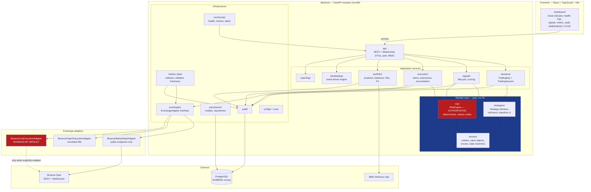

# Architecture

**Style:** modular monolith. See [ADR-0001](adr/0001-modular-monolith.md).

---

## 1. System diagram



---

## 2. The central architectural rule

Every path that can produce an order passes through `risk/`. There is **no**
edge from `strategies/` to `execution/`.

This is enforced by an automated architecture test over the import graph, not
by convention or code review. A strategy that could submit an order directly
would make every risk guarantee in this repository void.

---

## 3. Module responsibilities

| Module | Responsibility | May depend on |
|--------|----------------|---------------|
| `api/` | HTTP and WebSocket surface, DTOs, authentication, RBAC | application services |
| `core/` | Logging, errors, clock, decimal helpers, identifier generation | nothing internal |
| `config/` | Pydantic settings, feature flags, mode guards | `core/` |
| `domain/` | Entities, value objects, enums, state machines. **Pure — no I/O** | `core/` |
| `market_data/` | Collection, validation, freshness and gap detection | `exchanges/`, `domain/`, `persistence/` |
| `exchanges/` | `ExchangeAdapter` interface and its implementations | `domain/`, `core/` |
| `strategies/` | Strategy interface, indicators, baseline strategy | `domain/` |
| `signals/` | Signal generation, scoring, lifecycle, expiry | `strategies/`, `risk/`, `domain/` |
| `risk/` | The authoritative risk engine | `domain/` |
| `execution/` | Order intent, submission, reconciliation | `risk/`, `exchanges/`, `domain/` |
| `portfolio/` | Positions, balances, P&L, FX conversion | `domain/`, `persistence/` |
| `sessions/` | Trading day and session orchestration | `risk/`, `signals/`, `execution/` |
| `backtesting/` | Event-driven engine reusing the same strategy and risk logic | `strategies/`, `risk/`, `domain/` |
| `reporting/` | Metrics and report generation | `persistence/` |
| `audit/` | Immutable audit trail | `persistence/` |
| `monitoring/` | Health checks and metrics | everything, read-only |
| `persistence/` | SQLAlchemy models, repositories, unit of work | `domain/` |

**`domain/` performs no I/O.** No HTTP, no database, no filesystem, no clock
reads other than through an injected clock. This is what makes the risk engine
and the state machines testable without an exchange or a database.

---

## 4. Exchange abstraction

```text
ExchangeAdapter
├── BinanceMarketDataAdapter        public endpoints, no credentials
├── BinancePaperExecutionAdapter    simulated fills, fees, slippage
└── BinanceLiveExecutionAdapter     real orders, disabled by default
```

Live and paper execution are **separate classes**, never one class with
scattered conditionals. A conditional can be reached by accident; a class that
is never instantiated cannot be.

The interface covers, where applicable: server time, exchange information,
symbol filters, current prices, order book, historical candles, live candle
streams, account balances, open orders, order lookup, order submission, order
cancellation, recent fills, account event streams, and connectivity health
checks.

Crypto.com will be added later as a sibling implementation. Strategies, the
risk engine, the session engine and application services must not change when
it is.

---

## 5. Repository layout

```text
trader/
├── backend/
│   ├── app/
│   │   ├── api/
│   │   ├── core/
│   │   ├── config/
│   │   ├── domain/
│   │   ├── market_data/
│   │   ├── exchanges/
│   │   │   ├── base.py
│   │   │   └── binance/
│   │   ├── strategies/
│   │   ├── signals/
│   │   ├── risk/
│   │   ├── execution/
│   │   ├── portfolio/
│   │   ├── sessions/
│   │   ├── backtesting/
│   │   ├── reporting/
│   │   ├── audit/
│   │   ├── monitoring/
│   │   └── persistence/
│   ├── alembic/
│   ├── tests/
│   ├── pyproject.toml
│   └── Dockerfile
├── frontend/
│   ├── src/
│   ├── package.json
│   └── Dockerfile
├── docs/
├── docker-compose.yml
├── .env.example
├── .gitignore
└── .github/workflows/ci.yml
```

`backend/` and `frontend/` are separate roots so that their Dockerfiles, CI
jobs and tooling (Ruff and mypy versus ESLint and `tsc`) never interfere.

---

## 6. Cross-cutting rules

| Rule | Rationale |
|------|-----------|
| Money is `Decimal` in Python and `NUMERIC` in PostgreSQL | Binary floating point cannot represent 0.1 exactly. Accumulated rounding error in a financial ledger is a correctness bug, not a rounding detail. |
| Timestamps are stored in UTC | A single unambiguous ordering. Local time is a presentation concern. |
| Exchange requests are signed only in the backend | The frontend must never hold or transmit credentials. |
| Every state transition emits an audit event | Every trade must be reconstructable after the fact. |
| Uncertain order state triggers reconciliation | Never a blind retry. |
| The safe default on any failure is to stop opening new positions | Existing positions are still managed to exit. |
