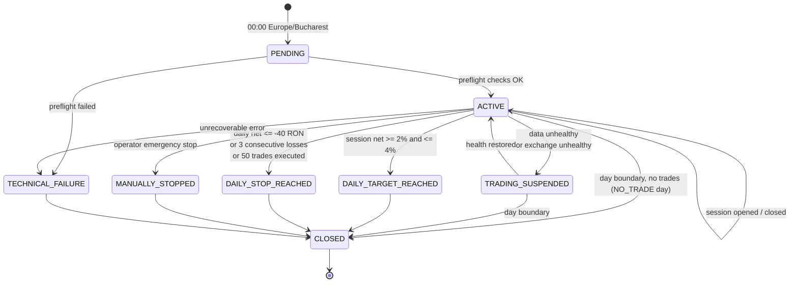
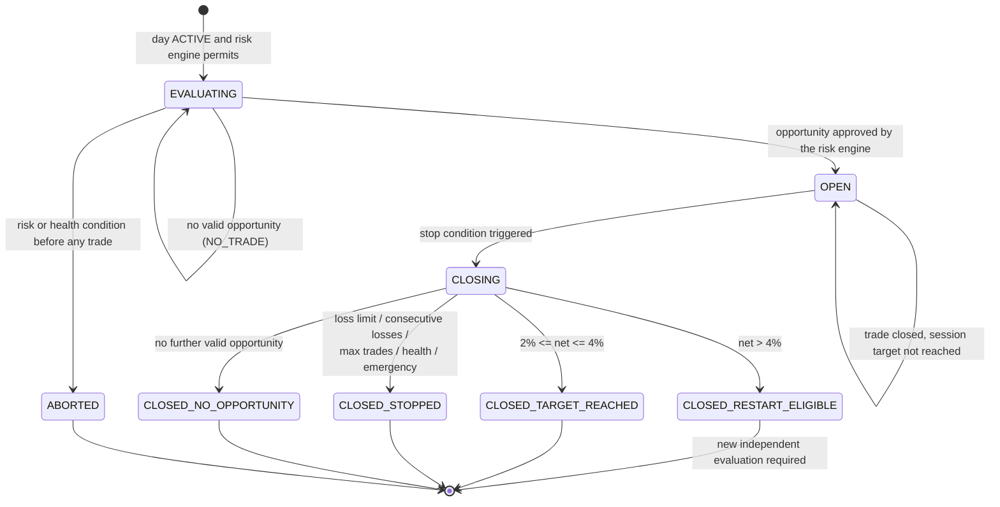
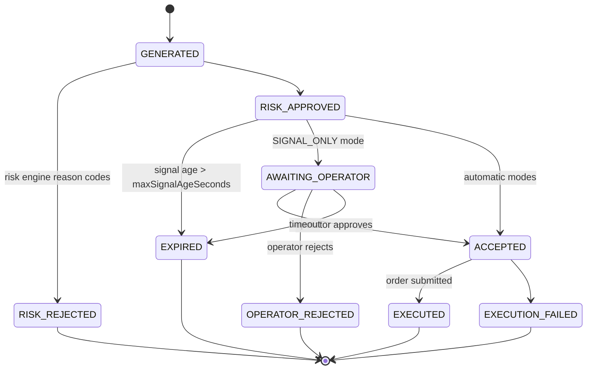
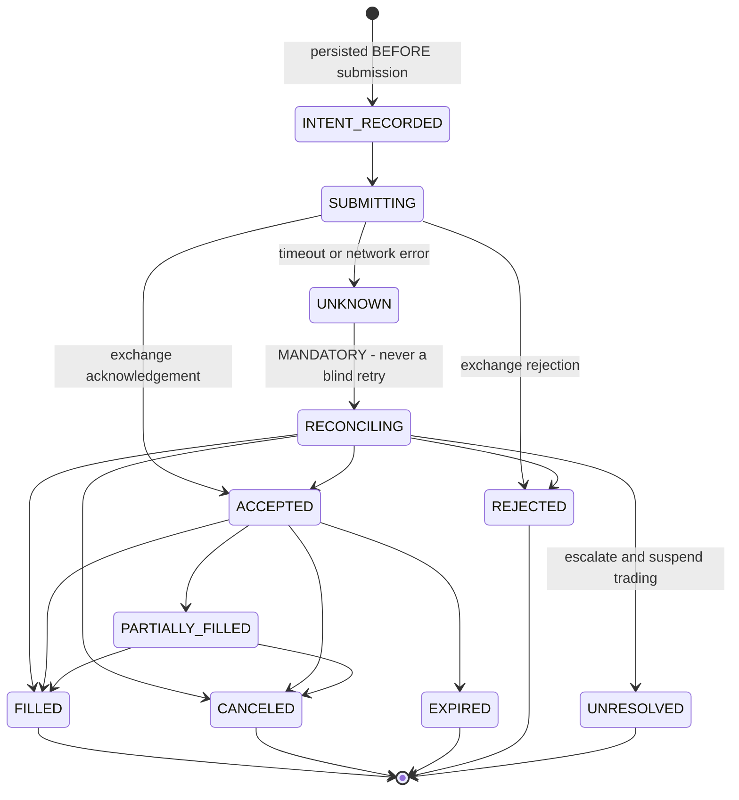
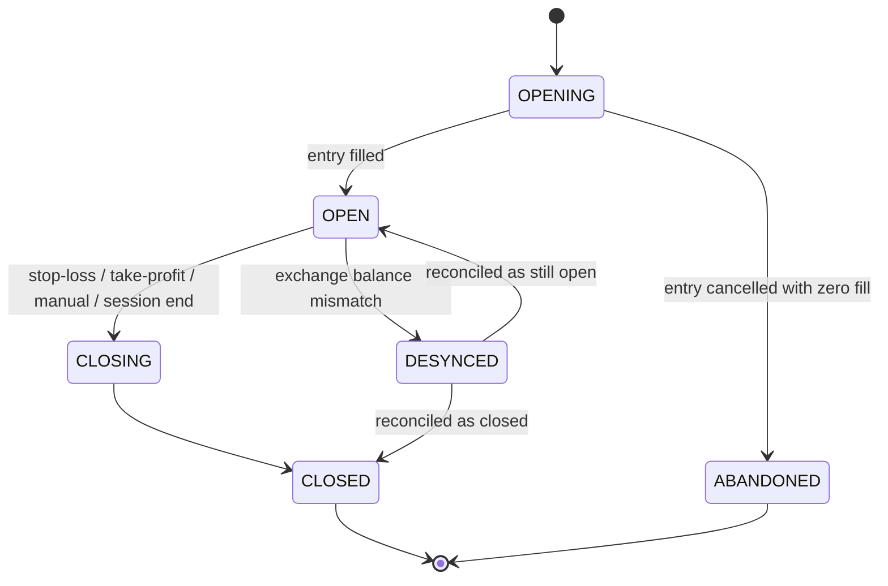
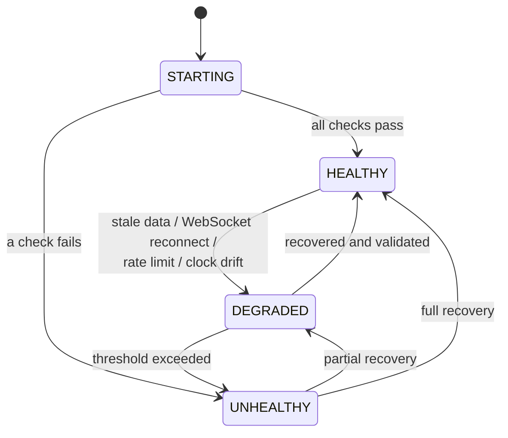

# State Machines

Six state machines govern the system. Every transition is persisted as an
audit event; no state ever changes silently.

---

## 1. TradingDay

`NO_TRADE` is not a state. It is the **outcome** of a day that reaches `CLOSED`
with `tradeCount = 0`, and also the per-scan decision when no opportunity
qualifies.

Any halted state still manages existing positions to exit. Only new entries are
blocked.

---

## 2. TradingSession

`CLOSED_RESTART_ELIGIBLE` makes a new session **possible**. It never **causes**
one. A new session starts only when a fresh opportunity independently satisfies
every strategy and risk criterion, and the -40 RON daily floor still applies.

---

## 3. Signal

---

## 4. Order

The `UNKNOWN -> RECONCILING` edge is the most important transition in the
system. It is where most trading bots lose real money: they resubmit an order
that the exchange had in fact already accepted.

`INTENT_RECORDED` exists so that a crash between the decision and the exchange
acknowledgement is always recoverable. The intent carries a locally generated
`clientOrderId`, which makes reconciliation and idempotency possible.

---

## 5. Position

`DESYNCED` blocks all new entries until reconciliation completes.

---

## 6. SystemHealth

**Safety rule:** `DEGRADED` and `UNHEALTHY` block opening new positions.
Management of existing positions, including stop-loss monitoring, continues.
Abandoning an open position is more dangerous than declining a new one.

---

## 7. Day-boundary attribution

Because positions may cross midnight (decision OD-04), attribution must be
unambiguous.

| Item | Attributed to |
|------|---------------|
| `tradeCount` (R-05) | The day the position was **opened** |
| `realisedPnl` | The day the trade was **closed** |
| `consecutiveLosses` | Updated at close, so the closing day |
| Unrealised P&L of a carried position | The **current** day (R-26) |
| Position slot (R-04) | **Occupied** at the start of the new day |

`Trade` therefore carries both `openedTradingDayId` and `closedTradingDayId`.

A new day may legitimately start with its position slot already taken and part
of its risk budget already consumed by mark-to-market. This is correct
behaviour.
